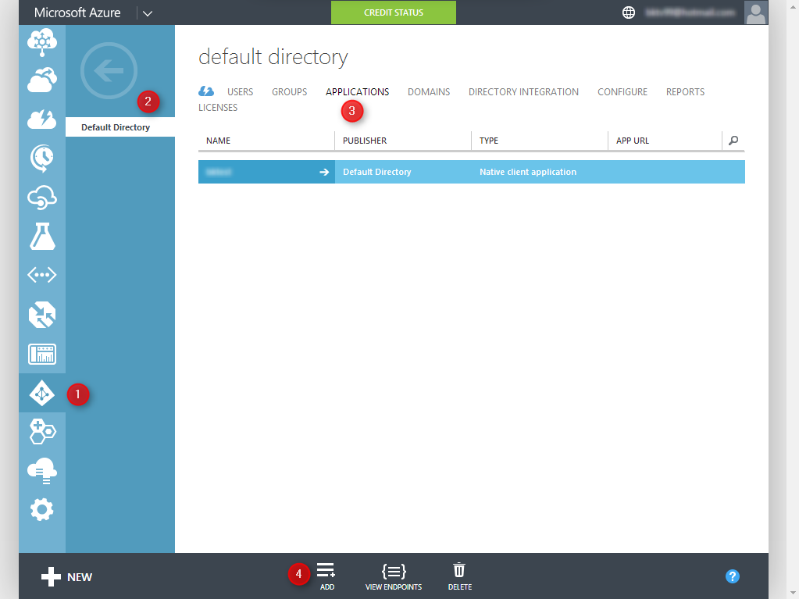
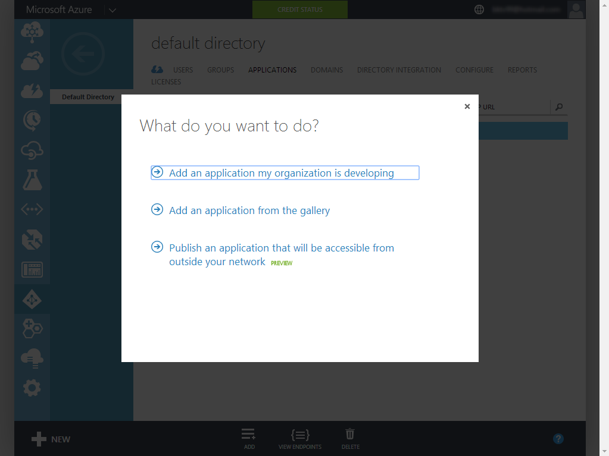
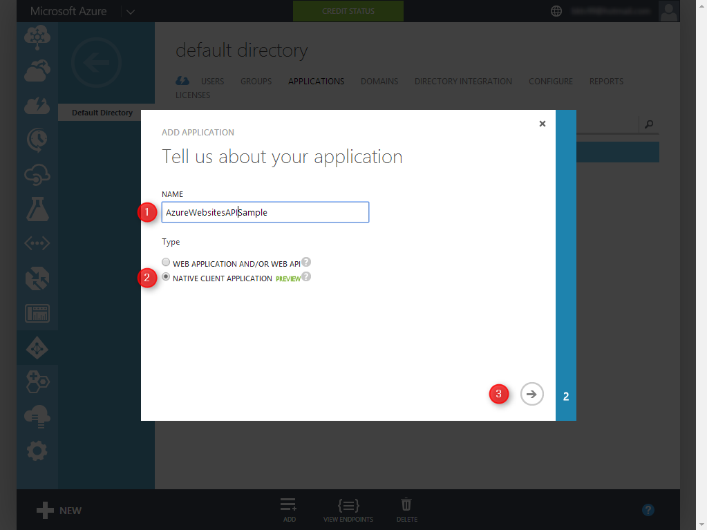
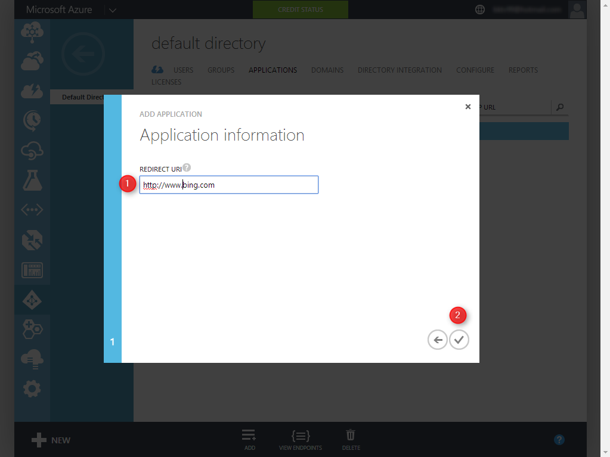
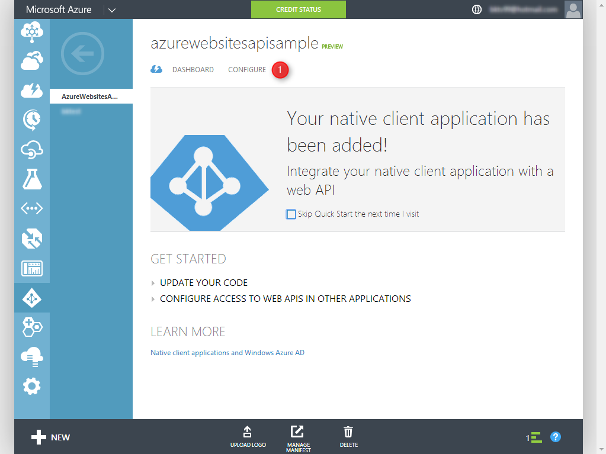
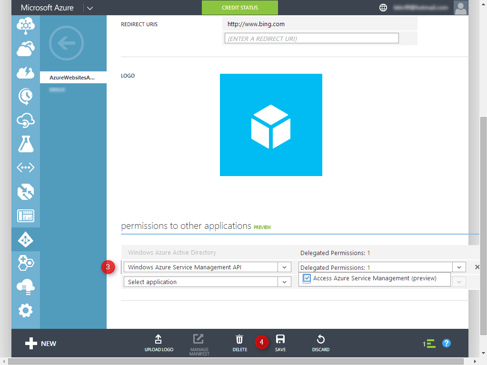
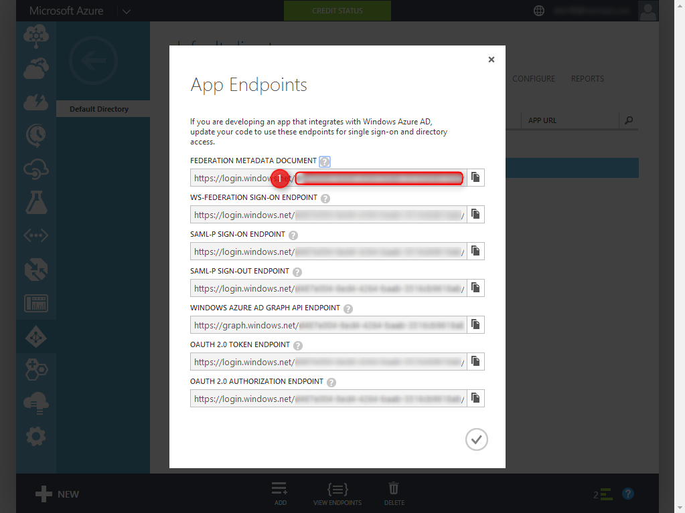
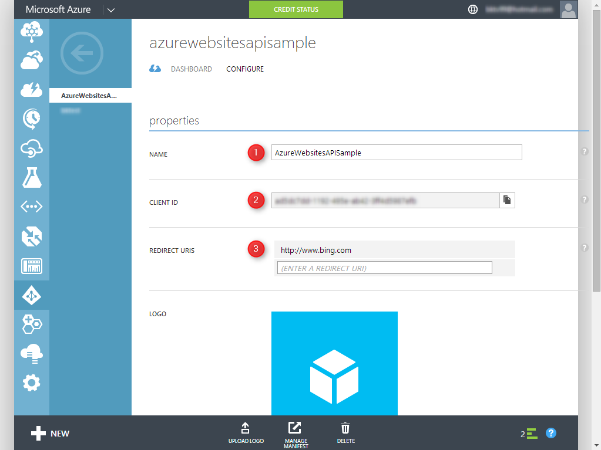

#Introduction
This document provides an overview of the Azure Websites Management Client Samples for .NET.

This samples are currently hosted here: https://github.com/btardif/AzureWebsitesAPISamples

The samples use the [Active Directory Authentication Library](http://www.nuget.org/packages/Microsoft.IdentityModel.Clients.ActiveDirectory/2.8.10804.1442-rc) to perform authentication/authorization operations against Azure.

The samples uses the [Microsoft Azure Web Sites Resource Management Library](http://www.nuget.org/packages/Microsoft.Azure.Management.WebSites/0.10.0-prerelease) to perform management operations against Azure Websites.


#Getting Started
##Pre-requisites:
To use this samples you will need:

1. Having an Azure Subscriptions
2. Follow the instructions in Azure Active Directory Configuration
3. Use Visual Studio to run and step through the samples.


###Azure Active Directory Configuration
This API samples use Azure Active Directory to authorize/authenticate access to the API.
Follow the instructions below to configure your subscription to enable access to the Azure Resource Manager API.
As part of this configuration step, we will gather the following information to use when configuring the samples:

- Azure Subscription ID
-  Azure Active Directory Tenant ID
-  Azure Active Directory Application Name
-  Azure Active Directory Application Redirect
-  Azure Active Directory Client ID

####Step 1: Create a new Application under Azure Active Directory
1.	Navigate to the [Azure Management portal](http://www.manage.azure.com) and select Azure Active Directory
2.	Select the Azure Active Directory Tenant to use for this example I’m using the Default Directory
3.	Click on the APPLICATIONS tab
4.	Click on the ADD button to create a new application

>

This will pop up the new Azure Active Directory Application creation wizard

**Click on Add an application my organization is developing**

>

In the next step of the wizard you will need to:

1.	Provide a **Name** for your application
2.	Select **Native Client Application** option
3.	**Click** to go through to the next screen of the wizard


>

In the final step of the wizard you will need to:

1.	Provide a **REDIRECT URI**
	-	**Note** that since this is a console application this value can be anything as long as it's a valid URI
2.	**Click** on the **Check Mark** to complete the wizard


>

####Step 2: Configure your newly created Active Directory Application to access the Azure Resource Manager APIs
1.	Select the **CONFIGURE** tab to enter the Azure Active Directory application configuration page
<br /><br />

2.	In the Azure Active Directory application Configuration tab scroll to the bottom of the page to the **permissions to other applications** section
<br />

3.	Add the **Windows Azure Service Management API** application and delegate permissions to **Access Azure Service Management**<br />
4.	**Click** the **SAVE** button to save your changes


####Step 3: Collect the configuration information
#####Azure Subscription ID
The azure subscription id can be found by going to the **SETTINGS** section of the **Azure Management Portal** under the **SUBSCRIPTIONS** tab
>

#####Azure Active Directory Tenant ID
**Azure Active Directory Tenant ID** can be found by **Azure Active Directory** section of the **Azure Management Portal** and selecting the correct directory. You should see your configured **Azure Active Directory Application** listed.

**Click** on **View Endpoints**
>

The **Azure Active Directory Tenant Id** is an alphanumeric string that is part of the URI of your authentication endpoints:
>

#####Azure Active Directory Application Name, Tenant ID and Redirect URIs
Navigate to the **Azure Active Directory** section, select the **APPLICATIONS** tab and select your application form the list then click on the **CONFIGURE** tab.
The **Azure Active Directory Application Name**, **CientID** and **Redirect URI** are presented in this page.
>

####Step 4 UppdateAppConfig
The **Websites-ARM-SampleExplorer** contains an **App.config** file with place holder values for all of the necessary configuration settings.

Replace all the placeholder values with the right settings you collected in **Step 3**

```
<appSettings>
    <!-- Subscription-->
    <add key="subscriptionID" value="Subscription ID"/>

    <!--AAD Configuration-->
    <add key="ActiveDirectoryApplicationName" value="Application NAme"/>
    <add key="ActiveDirectoryApplicationRedirect" value="Redirect URL"/>
    <add key="ActiveDirectoryClientID" value="Client ID"/>
    <add key="ActiveDirectoryadTenant" value="Tenant ID"/>
    <add key="ActiveDirectoryResourceUri" value="https://management.core.windows.net/"/>
</appSettings>
```

##Web Hosting Plan Samples
Web Hosting Plan operations

##Websites Samples
Websites operations
